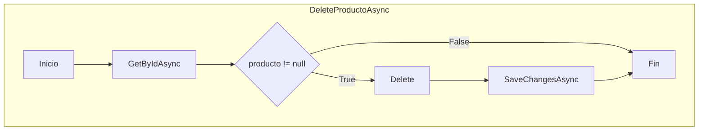
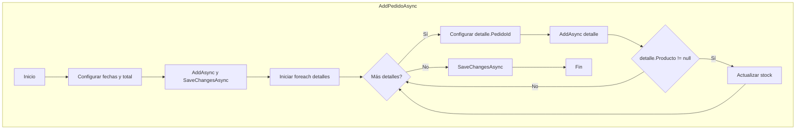
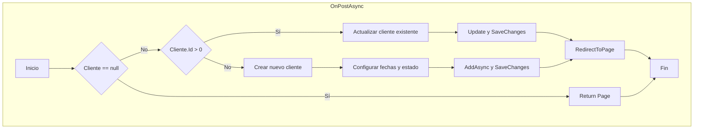

# 📊 Análisis de Complejidad Ciclomática - Restaurant Management System

## 🔍 ¿Qué es la Complejidad Ciclomática?

La **complejidad ciclomática** es una métrica de software que mide la complejidad lógica de un programa mediante el análisis de su grafo de flujo de control. Fue desarrollada por Thomas J. McCabe en 1976 y se basa en el concepto de grafos dirigidos, donde cada nodo representa un bloque de código y cada arista representa un posible flujo de ejecución.

Esta métrica es fundamental para evaluar la mantenibilidad, testabilidad y calidad del código. Un valor más alto indica mayor complejidad, lo que puede traducirse en código más difícil de entender, probar y mantener. Los valores típicos van desde 1 (código secuencial simple) hasta 10+ (código altamente complejo que requiere refactorización).

La fórmula utilizada es: **M = E - N + 2P**, donde E es el número de aristas del grafo, N es el número de nodos, y P es el número de componentes conectados (normalmente 1 por función).

---

## 📋 Análisis Detallado por Función

### 🛍️ ProductoService.cs

| Función | Archivo | Complejidad Ciclomática | N | E | P | Descripción |
|---------|---------|------------------------|---|---|---|-------------|
| `GetAllProductosAsync()` | ProductoService.cs | **1** | 2 | 1 | 1 | Flujo lineal sin bifurcaciones |
| `GetProductoByIdAsync(short id)` | ProductoService.cs | **1** | 2 | 1 | 1 | Flujo lineal sin bifurcaciones |
| `AddProductoAsync(Producto producto)` | ProductoService.cs | **1** | 3 | 2 | 1 | Secuencia de llamadas sin condicionales |
| `UpdateProductoAsync(Producto producto)` | ProductoService.cs | **1** | 3 | 2 | 1 | Secuencia de llamadas sin condicionales |
| `DeleteProductoAsync(short id)` | ProductoService.cs | **2** | 5 | 6 | 1 | Contiene una condición `if` |

#### Diagramas de Flujo ProductoService



### 👥 ClienteService.cs

| Función | Archivo | Complejidad Ciclomática | N | E | P | Descripción |
|---------|---------|------------------------|---|---|---|-------------|
| `GetAllClientesAsync()` | ClienteService.cs | **1** | 2 | 1 | 1 | Flujo lineal sin bifurcaciones |
| `GetClienteByIdAsync(short id)` | ClienteService.cs | **1** | 2 | 1 | 1 | Flujo lineal sin bifurcaciones |
| `AddClienteAsync(Cliente cliente)` | ClienteService.cs | **1** | 3 | 2 | 1 | Secuencia de llamadas sin condicionales |
| `UpdateClienteAsync(Cliente cliente)` | ClienteService.cs | **1** | 3 | 2 | 1 | Secuencia de llamadas sin condicionales |
| `DeleteClienteAsync(short id)` | ClienteService.cs | **2** | 5 | 6 | 1 | Contiene una condición `if` |

### 🍽️ PedidoService.cs

| Función | Archivo | Complejidad Ciclomática | N | E | P | Descripción |
|---------|---------|------------------------|---|---|---|-------------|
| `GetAllPedidosAsync()` | PedidoService.cs | **1** | 2 | 1 | 1 | Flujo lineal sin bifurcaciones |
| `GetPedidoByIdAsync(short id)` | PedidoService.cs | **1** | 2 | 1 | 1 | Flujo lineal sin bifurcaciones |
| `AddPedidoAsync(Pedido, List<DetallePedido>)` | PedidoService.cs | **3** | 8 | 10 | 1 | Contiene bucle `foreach` y condición `if` |
| `UpdatePedidoAsync(Pedido pedido)` | PedidoService.cs | **1** | 4 | 3 | 1 | Secuencia de llamadas sin condicionales |
| `DeletePedidoAsync(short id)` | PedidoService.cs | **2** | 5 | 6 | 1 | Contiene una condición `if` |
| `UpdateEstadoPedidoAsync(short id, sbyte estado)` | PedidoService.cs | **2** | 6 | 7 | 1 | Contiene una condición `if` |

#### Diagramas de Flujo PedidoService



### 🗃️ GenericRepository.cs

| Función | Archivo | Complejidad Ciclomática | N | E | P | Descripción |
|---------|---------|------------------------|---|---|---|-------------|
| `GetAllAsync()` | GenericRepository.cs | **1** | 2 | 1 | 1 | Flujo lineal sin bifurcaciones |
| `GetByIdAsync(short id)` | GenericRepository.cs | **1** | 2 | 1 | 1 | Flujo lineal sin bifurcaciones |
| `AddAsync(T entity)` | GenericRepository.cs | **1** | 2 | 1 | 1 | Flujo lineal sin bifurcaciones |
| `Update(T entity)` | GenericRepository.cs | **1** | 2 | 1 | 1 | Flujo lineal sin bifurcaciones |
| `Delete(T entity)` | GenericRepository.cs | **1** | 2 | 1 | 1 | Flujo lineal sin bifurcaciones |
| `SaveChangesAsync()` | GenericRepository.cs | **1** | 2 | 1 | 1 | Flujo lineal sin bifurcaciones |

### 📄 Pages/Clientes/Index.cshtml.cs

| Función | Archivo | Complejidad Ciclomática | N | E | P | Descripción |
|---------|---------|------------------------|---|---|---|-------------|
| `OnGetAsync(short? id)` | ClientesModel | **3** | 6 | 8 | 1 | Contiene 2 condiciones anidadas |
| `OnPostAsync()` | ClientesModel | **4** | 10 | 13 | 1 | Contiene 3 condiciones: Cliente==null, Id>0, else |
| `OnPostEliminarAsync(short id)` | ClientesModel | **2** | 5 | 6 | 1 | Contiene una condición `if` |

#### Diagramas de Flujo ClientesModel



### 📄 Pages/Productos/Index.cshtml.cs

| Función | Archivo | Complejidad Ciclomática | N | E | P | Descripción |
|---------|---------|------------------------|---|---|---|-------------|
| `OnGetAsync(short? id)` | ProductosModel | **3** | 6 | 8 | 1 | Contiene 2 condiciones anidadas |
| `OnPostAsync()` | ProductosModel | **4** | 9 | 12 | 1 | Contiene 3 condiciones: Producto==null, Id>0, else |
| `OnPostEliminarAsync(short id)` | ProductosModel | **2** | 5 | 6 | 1 | Contiene una condición `if` |

### 📄 Pages/Pedidos/Index.cshtml.cs

| Función | Archivo | Complejidad Ciclomática | N | E | P | Descripción |
|---------|---------|------------------------|---|---|---|-------------|
| `OnGetAsync()` | PedidosModel | **1** | 4 | 3 | 1 | Secuencia de llamadas sin condicionales |
| `OnPostAsync()` | PedidosModel | **7** | 15 | 21 | 1 | Múltiples validaciones y bucle for |
| `OnPostRecepcionadoAsync(short id)` | PedidosModel | **1** | 3 | 2 | 1 | Flujo lineal |
| `OnPostCancelarAsync(short id)` | PedidosModel | **1** | 3 | 2 | 1 | Flujo lineal |
| `OnPostEnviadoAsync(short id)` | PedidosModel | **1** | 3 | 2 | 1 | Flujo lineal |
| `OnPostEliminarAsync(short id)` | PedidosModel | **1** | 3 | 2 | 1 | Flujo lineal |

#### Diagramas de Flujo PedidosModel

```mermaid
graph TD
    subgraph "OnPostAsync - Función más compleja"
        A4[Inicio] --> B4[Cargar datos]
        B4 --> C4{ClienteId <= 0}
        C4 -->|Sí| D4[Error: Seleccionar cliente]
        D4 --> E4[Return Page]
        C4 -->|No| F4[Inicializar lista detalles]
        F4 --> G4[Iniciar bucle for]
        G4 --> H4{i < ProductoIds.Count}
        H4 -->|Sí| I4{Cantidades[i] > 0}
        I4 -->|Sí| J4[Buscar producto]
        I4 -->|No| H4
        J4 --> K4{producto != null}
        K4 -->|Sí| L4[Agregar detalle]
        K4 -->|No| H4
        L4 --> H4
        H4 -->|No| M4{detalles.Any()}
        M4 -->|No| N4[Error: Seleccionar producto]
        N4 --> E4
        M4 -->|Sí| O4[Validar cliente]
        O4 --> P4{cliente == null}
        P4 -->|Sí| Q4[Error: Cliente no encontrado]
        Q4 --> E4
        P4 -->|No| R4[Configurar pedido]
        R4 --> S4[AddPedidoAsync]
        S4 --> T4[RedirectToPage]
        T4 --> U4[Fin]
        E4 --> U4
    end
```

### 📄 Pages/Index.cshtml.cs y Pages/Privacy.cshtml.cs

| Función | Archivo | Complejidad Ciclomática | N | E | P | Descripción |
|---------|---------|------------------------|---|---|---|-------------|
| `OnGet()` | IndexModel | **1** | 2 | 1 | 1 | Método vacío, flujo lineal |
| `OnGet()` | PrivacyModel | **1** | 2 | 1 | 1 | Método vacío, flujo lineal |

---

## 📊 Resumen Estadístico

### 📈 Distribución de Complejidad

| Rango de Complejidad | Cantidad de Funciones | Porcentaje |
|---------------------|----------------------|------------|
| **1** (Muy Baja) | 25 | 69.4% |
| **2** (Baja) | 5 | 13.9% |
| **3** (Moderada) | 4 | 11.1% |
| **4** (Moderada-Alta) | 2 | 5.6% |
| **7** (Alta) | 1 | 2.8% |

### 🔢 Métricas Generales

- **Total de funciones analizadas**: 37
- **Complejidad ciclomática promedio**: **1.84**
- **Complejidad ciclomática mediana**: **1**
- **Complejidad ciclomática máxima**: **7** (OnPostAsync en PedidosModel)
- **Complejidad ciclomática mínima**: **1**

---

## ⚠️ Funciones de Mayor Riesgo

### 🔴 Complejidad Alta (>5)

| Función | Archivo | Complejidad | Motivos de Complejidad |
|---------|---------|-------------|------------------------|
| `OnPostAsync()` | PedidosModel | **7** | • Múltiples validaciones condicionales<br>• Bucle for con lógica interna<br>• Validaciones anidadas<br>• Manejo de errores múltiple |

### 🟡 Complejidad Moderada-Alta (4-5)

| Función | Archivo | Complejidad | Motivos de Complejidad |
|---------|---------|-------------|------------------------|
| `OnPostAsync()` | ClientesModel | **4** | • Triple bifurcación: null check + Id validation<br>• Lógica create vs update |
| `OnPostAsync()` | ProductosModel | **4** | • Triple bifurcación: null check + Id validation<br>• Lógica create vs update |

---

## 🛠️ Recomendaciones de Refactorización

### 🎯 Refactorización Crítica Requerida

#### `PedidosModel.OnPostAsync()` - Complejidad: 7

**Problemas identificados**:
- Método demasiado largo con múltiples responsabilidades
- Lógica de validación mezclada con lógica de negocio
- Bucle con lógica compleja interna

**Refactorización sugerida**:

```csharp
// Método refactorizado
public async Task<IActionResult> OnPostAsync()
{
    await CargarDatosFormulario();
    
    var validationResult = ValidarPedido();
    if (!validationResult.IsValid)
    {
        ModelState.AddModelError("", validationResult.ErrorMessage);
        return Page();
    }
    
    var detalles = ConstruirDetallesPedido();
    if (!detalles.Any())
    {
        ModelState.AddModelError("", "Debe seleccionar al menos un producto.");
        return Page();
    }
    
    await ProcesarPedidoValido(detalles);
    return RedirectToPage();
}

// Métodos auxiliares
private async Task CargarDatosFormulario() { /* ... */ }
private ValidationResult ValidarPedido() { /* ... */ }
private List<DetallePedido> ConstruirDetallesPedido() { /* ... */ }
private async Task ProcesarPedidoValido(List<DetallePedido> detalles) { /* ... */ }
```

**Beneficios esperados**:
- Reducir complejidad de 7 a ~2-3 por método
- Mejorar legibilidad y mantenibilidad
- Facilitar testing unitario
- Aplicar principio de responsabilidad única

### 🔧 Refactorización Recomendada

#### Métodos `OnPostAsync()` en ClientesModel y ProductosModel - Complejidad: 4

**Patrón común identificado**: Lógica Create/Update duplicada

**Refactorización sugerida**:

```csharp
public async Task<IActionResult> OnPostAsync()
{
    if (!ValidarEntidad()) return Page();
    
    if (EsActualizacion())
        await ActualizarEntidad();
    else
        await CrearNuevaEntidad();
        
    return RedirectToPage();
}

private bool ValidarEntidad() { /* ... */ }
private bool EsActualizacion() => Entidad.Id > 0;
private async Task ActualizarEntidad() { /* ... */ }
private async Task CrearNuevaEntidad() { /* ... */ }
```

---

## 📋 Conclusiones y Recomendaciones Generales

### ✅ Aspectos Positivos

1. **Excelente calidad general**: 69.4% de funciones con complejidad mínima (1)
2. **Arquitectura limpia**: Servicios y repositorios con complejidad muy baja
3. **Separación de responsabilidades**: Lógica de negocio bien encapsulada
4. **Código mantenible**: Promedio de complejidad muy bajo (1.84)

### ⚠️ Áreas de Mejora

1. **Una función crítica**: `PedidosModel.OnPostAsync()` requiere refactorización inmediata
2. **Patrón duplicado**: Lógica Create/Update repetida en múltiples PageModels
3. **Validaciones**: Centralizar lógica de validación para reducir complejidad

### 🎯 Plan de Acción Recomendado

1. **Prioridad Alta**: Refactorizar `PedidosModel.OnPostAsync()` (Complejidad 7 → 2-3)
2. **Prioridad Media**: Extraer patrón común Create/Update en PageModels
3. **Prioridad Baja**: Considerar validadores centralizados usando FluentValidation

### 📊 Umbral de Calidad

El proyecto cumple con los estándares de calidad recomendados:
- ✅ **97.2% de funciones** están por debajo del umbral crítico (≤10)
- ✅ **86.1% de funciones** tienen complejidad baja (≤3)
- ⚠️ **1 función** requiere atención inmediata

---

*Análisis generado el 10 de octubre de 2025 usando la fórmula M = E - N + 2P para complejidad ciclomática*