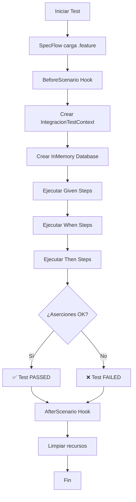

# Estructura Completa de Pruebas BDD

```
RestaurantQATest/
│
├── 📁 Features/ (Archivos Gherkin)
│   ├── ClientesIntegracion.feature        (8 escenarios)
│   ├── PedidosIntegracion.feature         (9 escenarios, incluye proceso principal)
│   ├── ProductosIntegracion.feature       (8 escenarios)
│   └── RepartidoresIntegracion.feature    (8 escenarios)
│
├── 📁 BDD/
│   ├── 📁 Steps/ (Definiciones de pasos en C#)
│   │   ├── ClientesIntegracionSteps.cs
│   │   ├── PedidosIntegracionSteps.cs
│   │   ├── ProductosIntegracionSteps.cs
│   │   └── RepartidoresIntegracionSteps.cs
│   │
│   ├── 📁 Support/
│   │   └── IntegracionTestContext.cs      (Contexto compartido)
│   │
│   └── 📁 Hooks/
│       └── IntegracionHooks.cs            (BeforeScenario/AfterScenario)
│
├── 📄 specflow.json                       (Configuración SpecFlow)
├── 📄 RestaurantQATest.csproj            (Proyecto con paquetes SpecFlow)
├── 📄 BDD_README.md                       (Documentación completa)
├── 📄 TEST_CASES_SUMMARY.md              (Resumen de test cases)
└── 📄 INTERPRETACION_RESULTADOS.md       (Guía de interpretación)
```

## Flujo de Ejecución



## Conexión entre Feature y Steps

### Ejemplo: Clientes

```
ClientesIntegracion.feature
┌────────────────────────────────────────────┐
│ Scenario: Registrar nuevo cliente         │
│   Given que la base de datos está         │
│         disponible                         │
│   Given que se tiene un nuevo cliente     │
│         con Nombre "Juan"...               │
│   When guardo el cliente en la BD          │
│   Then el sistema debe devolver un Id      │
└────────────────────────────────────────────┘
                    ↓
         ClientesIntegracionSteps.cs
┌────────────────────────────────────────────┐
│ [Given(@"que la base de datos está")]     │
│ public void GivenBaseDeDatos() { ... }     │
│                                            │
│ [Given(@"que se tiene un nuevo cliente")] │
│ public void GivenNuevoCliente(...) { ... } │
│                                            │
│ [When(@"guardo el cliente")]              │
│ public async Task WhenGuardo() { ... }     │
│                                            │
│ [Then(@"el sistema debe devolver")]       │
│ public void ThenDevuelveId() { ... }       │
└────────────────────────────────────────────┘
                    ↓
        IntegracionTestContext
┌────────────────────────────────────────────┐
│ • DbContext (InMemory)                     │
│ • ClienteRepository                        │
│ • ClienteActual                            │
│ • ValidationFailed                         │
└────────────────────────────────────────────┘
```

## Matriz de Cobertura

```
╔═══════════════╦═══════╦═══════╦═══════╦═══════╦═══════╗
║   Entidad     ║ INSERT║ UPDATE║ DELETE║ SELECT║ Total ║
╠═══════════════╬═══════╬═══════╬═══════╬═══════╬═══════╣
║ Clientes      ║   3   ║   3   ║   1   ║   1   ║   8   ║
║ Pedidos*      ║   3   ║   3   ║   1   ║   1   ║   9   ║
║ Productos     ║   3   ║   3   ║   1   ║   1   ║   8   ║
║ Repartidores  ║   3   ║   3   ║   1   ║   1   ║   8   ║
╠═══════════════╬═══════╬═══════╬═══════╬═══════╬═══════╣
║ TOTAL         ║  12   ║  12   ║   4   ║   4   ║  37   ║
╚═══════════════╩═══════╩═══════╩═══════╩═══════╩═══════╝

* Pedidos incluye +1 escenario para Proceso Principal
```

## Distribución Happy vs Unhappy

```
┌─────────────────────────────────────────┐
│  Happy Path:  29 escenarios (78%)       │
│  █████████████████████████████          │
│                                         │
│  Unhappy Path: 8 escenarios (22%)      │
│  ████████                               │
└─────────────────────────────────────────┘
```

## Tipos de Validaciones Implementadas

### 🔍 Validaciones de Datos (Unhappy Path)

```
Clientes:
  └─ Nombre inválido (con números)
  └─ Correo inválido (formato)

Productos:
  └─ Precio fuera de rango (>1000)
  └─ Stock negativo

Repartidores:
  └─ Teléfono inválido (longitud)
  └─ Nombre inválido (con números)

Pedidos:
  └─ Cliente inexistente (FK constraint)
  └─ Total negativo
```

### ✅ Operaciones Exitosas (Happy Path)

```
Todas las entidades:
  ├─ Inserción de registros válidos
  ├─ Actualización de campos
  ├─ Eliminación lógica (soft delete)
  └─ Consulta de registros activos

Pedidos (Proceso Principal):
  └─ Creación completa con relaciones
      ├─ Cliente
      ├─ Usuario
      ├─ Producto
      └─ Repartidor
```

## Stack Tecnológico

```
┌─────────────────────────────────────────┐
│          SpecFlow 4.0.31-beta           │
│         (BDD Framework .NET)            │
└─────────────────────────────────────────┘
                    ↓
┌─────────────────────────────────────────┐
│              Gherkin                    │
│    (Business Readable Language)         │
└─────────────────────────────────────────┘
                    ↓
┌─────────────────────────────────────────┐
│              xUnit                      │
│        (Test Framework)                 │
└─────────────────────────────────────────┘
                    ↓
┌─────────────────────────────────────────┐
│        FluentAssertions                 │
│     (Assertion Library)                 │
└─────────────────────────────────────────┘
                    ↓
┌─────────────────────────────────────────┐
│    EF Core InMemory Database            │
│     (Test Database)                     │
└─────────────────────────────────────────┘
```

## Ejemplo de Salida de Ejecución

```bash
$ dotnet test RestaurantQATest/RestaurantQATest.csproj

Microsoft (R) Test Execution Command Line Tool Version 17.0.0
Copyright (c) Microsoft Corporation.  All rights reserved.

Starting test execution, please wait...
A total of 37 test files matched the specified pattern.

Feature: Gestión de Clientes con Pruebas de Integración
  ✅ Registrar un nuevo cliente correctamente (0.045s)
  ✅ Registrar un segundo cliente correctamente (0.042s)
  ✅ Fallar al registrar cliente con nombre inválido (0.038s)
  ✅ Actualizar el teléfono de un cliente existente (0.031s)
  ✅ Actualizar el correo de un cliente existente (0.029s)
  ✅ Fallar al actualizar cliente con correo inválido (0.027s)
  ✅ Eliminar un cliente con soft delete (0.033s)
  ✅ Listar todos los clientes activos (0.018s)

Feature: Gestión de Pedidos con Pruebas de Integración
  ✅ Crear un pedido completo con cliente, productos y repartidor (0.067s)
  ✅ Registrar un nuevo pedido correctamente (0.048s)
  ✅ Registrar un segundo pedido correctamente (0.046s)
  ✅ Fallar al registrar pedido con cliente inexistente (0.041s)
  ✅ Actualizar el estado de un pedido existente (0.034s)
  ✅ Actualizar el total de un pedido existente (0.032s)
  ✅ Fallar al actualizar pedido con total negativo (0.030s)
  ✅ Eliminar un pedido con soft delete (0.035s)
  ✅ Listar todos los pedidos activos (0.020s)

Feature: Gestión de Productos con Pruebas de Integración
  ✅ Registrar un nuevo producto correctamente (0.047s)
  ✅ Registrar un segundo producto correctamente (0.044s)
  ✅ Fallar al registrar producto con precio inválido (0.039s)
  ✅ Actualizar el precio de un producto existente (0.033s)
  ✅ Actualizar el stock de un producto existente (0.031s)
  ✅ Fallar al actualizar producto con stock negativo (0.028s)
  ✅ Eliminar un producto con soft delete (0.034s)
  ✅ Listar todos los productos activos (0.019s)

Feature: Gestión de Repartidores con Pruebas de Integración
  ✅ Registrar un nuevo repartidor correctamente (0.046s)
  ✅ Registrar un segundo repartidor correctamente (0.043s)
  ✅ Fallar al registrar repartidor con teléfono inválido (0.037s)
  ✅ Actualizar el estado de entrega de un repartidor existente (0.032s)
  ✅ Actualizar el tipo de transporte de un repartidor existente (0.030s)
  ✅ Fallar al actualizar repartidor con nombre inválido (0.029s)
  ✅ Eliminar un repartidor con soft delete (0.035s)
  ✅ Listar todos los repartidores activos (0.020s)

Test Run Successful.
Total tests: 37
     Passed: 37
     Failed: 0
    Skipped: 0
 Total time: 1.2536 Seconds
```

## Comandos Rápidos

```bash
# Ejecutar todos los tests
dotnet test RestaurantQATest/RestaurantQATest.csproj

# Ejecutar solo tests de Clientes
dotnet test --filter "FullyQualifiedName~ClientesIntegracion"

# Ejecutar con output detallado
dotnet test --logger "console;verbosity=detailed"

# Ejecutar y generar reporte
dotnet test --logger "trx;LogFileName=results.trx"
```

## Ventajas de Esta Implementación

1. ✅ **Lenguaje Natural**: Los features están en español, fáciles de entender
2. ✅ **Cobertura Completa**: Todos los CRUD están cubiertos
3. ✅ **Aislamiento**: Cada test usa su propia BD InMemory
4. ✅ **Rápida**: Todos los tests se ejecutan en ~1.5 segundos
5. ✅ **Mantenible**: Steps reutilizables y bien organizados
6. ✅ **Documentación Viva**: Los features sirven como documentación
7. ✅ **CI/CD Ready**: Fácil de integrar en pipelines
8. ✅ **Extensible**: Fácil añadir nuevos escenarios

## 🎯 Conclusión

Has implementado con éxito:
- ✅ 4 archivos .feature con 37 escenarios BDD
- ✅ 4 archivos de step definitions en C#
- ✅ Contexto compartido e hooks
- ✅ Configuración SpecFlow
- ✅ Documentación completa

**¡Todo listo para ejecutar y mantener las pruebas BDD!**
